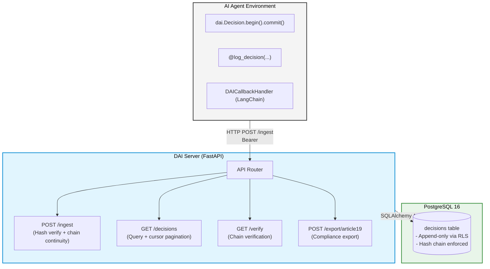

<div align="center">
  <h1>🛡️ DAI SDK<br/>Decision Authority Infrastructure</h1>

  <p>
    <strong>Append-only decision ledger for AI agents in regulated environments.</strong><br>
    <em>EU AI Act Article 19 compliant by design.</em>
  </p>

  [](https://www.python.org/downloads/)
  [](https://opensource.org/licenses/MIT)
  [](https://artificialintelligenceact.eu/)

  <p>Built by <strong><a href="https://github.com/Mandate">Mandate</a></strong> — <a href="https://github.com/Mandate/DecisionLedger">github.com/Mandate/DecisionLedger</a></p>
</div>

<hr/>

## 📖 Table of Contents

- [The Problem](#-the-problem)
- [What DAI Records](#-what-dai-records)
- [Quickstart (15 minutes)](#-quickstart-15-minutes)
- [SDK Usage Patterns](#-sdk-usage-patterns)
- [Configuration](#%EF%B8%8F-configuration)
- [CLI Reference](#-cli-reference)
- [EU AI Act Compliance](#-eu-ai-act-article-19-compliance)
- [Hash Chain Verification](#-hash-chain-verification)
- [Architecture](#-architecture)
- [Roadmap](#-roadmap)
- [Contributing & Licence](#-contributing--licence)

<hr/>

## 🚨 The Problem

AI agents make consequential decisions — approve a loan, triage a claim, flag a transaction — but those decisions are rarely recorded in a structured, auditable way. When regulators require an audit trail, or when an incident needs to be reconstructed, organisations discover they have logs but no ledger: timestamped text, not tamper-evident, typed records. 

The **EU AI Act (Article 19)** now mandates structured logging for high-risk AI systems. DAI provides exactly that, as a drop-in SDK.

<hr/>

## 📝 What DAI Records

Every decision produces a mathematically verifiable, tamper-evident record like this:

```yaml
decision_id:              "01927f3c-8a1b-7000-8000-000000000001"  # UUIDv7
record_hash:              "3a4f8c..."                              # SHA-256 of prev_hash + record
previous_hash:            "0000..."                               # Links to previous record
ledger_version:           "0.1.0"
decision_timestamp:       "2025-06-01T14:32:17.842311Z"
agent_id:                 "claims-agent-01"
agent_type:               "autonomous"
model_version:            "gpt-4o-2024-08-06"
authorized_scope:         "motor claims triage up to £10,000"
delegation_source:        "underwriting-team"
human_oversight_required: false
override_applied:         false
decision_type:            "claims_triage"
subject_ref:              "claim:CLM-2025-001234"
policy_id:                "motor-claims-v3"
policy_version:           "3.2.1"
clauses_applied:          ["3.1", "4.2", "5.0"]
outcome:                  "approved"
confidence:               0.93
evidence_refs:            ["doc:claim-form-v2", "img:damage-photo-01"]
data_sources_accessed:    ["claims-db", "policy-db", "fraud-api"]
context_completeness:     "full"
exception_applied:        false
metadata:
  claim_value_gbp:        "8500"
  region:                 "EU"
```

<hr/>

## 🚀 Quickstart (15 minutes)

### 1. Start the server

Boot up the PostgreSQL database and FastAPI server using Docker Compose:

```bash
git clone https://github.com/Mandate/DecisionLedger
cd DecisionLedger

# Setup environment variables
cp docker/.env.example docker/.env
# Edit docker/.env: set DAI_API_KEY and DAI_DB_PASSWORD

# Boot infrastructure
docker compose -f docker/docker-compose.yml up -d
docker compose -f docker/docker-compose.yml run --rm migrate

# Verify it's running
curl http://localhost:8080/health
# {"status": "ok", "version": "0.1.0"}
```

### 2. Install the SDK

Install the SDK into your AI agent's environment:

```bash
pip install dai-sdk  # published by Mandate

# Configure via environment variables
export DAI_ENDPOINT=http://localhost:8080
export DAI_API_KEY=your-key-from-env-file
```

### 3. Record your first decision

```python
import dai

result = (
    dai.Decision.begin(
        agent_id="test-agent",
        decision_type="test",
        subject_ref="item:001",
    )
    .with_policy(policy_id="test-policy", policy_version="1.0.0")
    .with_authority(authorized_scope="test", delegation_source="quickstart")
    .with_context(evidence_refs=["test:ref"], data_sources_accessed=["test-db"])
    .with_outcome(outcome="approved", confidence=0.95)
    .commit_sync()
)
print(f"Decision recorded: {result.decision_id}")
```

### 4. Verify the chain

Use the CLI tool to verify cryptographic integrity:

```bash
dai verify --from 2025-01-01 --to 2026-12-31
```

<hr/>

## 🧩 SDK Usage Patterns

DAI is unopinionated. Choose the integration pattern that best fits your codebase.

### Pattern 1 — Fluent Builder
*Best for explicitly constructed records deep in business logic.*

```python
import dai

result = await (
    dai.Decision.begin(
        agent_id="claims-agent-01",
        decision_type="claims_triage",
        subject_ref="claim:CLM-2025-001234",
        model_version="gpt-4o-2024-08-06",
    )
    .with_policy(
        policy_id="motor-claims-v3",
        policy_version="3.2.1",
        clauses_applied=["3.1", "4.2"],
    )
    .with_authority(
        authorized_scope="motor claims triage up to £10,000",
        delegation_source="underwriting-team",
        human_oversight_required=False,
    )
    .with_context(
        evidence_refs=["doc:claim-form-v2", "img:damage-photo-01"],
        data_sources_accessed=["claims-db", "policy-db", "fraud-api"],
    )
    .with_outcome(outcome="approved", confidence=0.93, alternatives_considered=3)
    .with_metadata("claim_value_gbp", "8500")
    .commit()
)
```

### Pattern 2 — Context Manager
*Best for wrapping sections of code. Auto-commits on exit, and logs safe fallbacks if exceptions occur.*

```python
async with dai.Decision.begin(
    agent_id="risk-agent",
    decision_type="risk_classification",
    subject_ref="application:APP-001",
) as d:
    d.with_policy("risk-policy-v2", "2.1.0")
    d.with_authority("risk scoring", "risk-team")
    d.with_context(["credit-report:ref"], ["credit-bureau-api"])
    
    result = await classify_risk(application_id="APP-001")
    
    d.with_outcome(outcome=result.label, confidence=result.score)
# Auto-commits on exit. If exception: records conservative_fallback.
```

### Pattern 3 — Decorator
*Best for clean, non-invasive integration with existing functions.*

```python
from dai.decorators import log_decision

@log_decision(
    agent_id="claims-agent",
    decision_type="claims_triage",
    policy_id="motor-claims-v3",
    policy_version="3.2.1",
    extract_subject=lambda args, kwargs: f"claim:{kwargs['claim_id']}",
    extract_outcome=lambda r: {"outcome": r.decision, "confidence": r.score},
)
async def triage_claim(claim_id: str, data: dict) -> TriageResult:
    # Your existing function — no changes needed
    ...
```

### Pattern 4 — LangChain Integration
*Best for out-of-the-box framework support.*

```python
from dai.integrations.langchain import DAICallbackHandler

handler = DAICallbackHandler(
    agent_id="my-agent",
    decision_type="claims_triage",
    policy_id="policy-v3",
    policy_version="3.2.1",
)
agent_executor = AgentExecutor(agent=agent, tools=tools, callbacks=[handler])
# Decisions recorded automatically on agent finish/error
```

<hr/>

## ⚙️ Configuration

Control SDK behaviour programmatically or via environment variables (`.env` files supported natively).

| Variable | Type | Default | Description |
|---|---|---|---|
| `DAI_BACKEND` | `http\|sqlite\|noop` | `http` | Storage backend |
| `DAI_ENDPOINT` | `str` | `http://localhost:8080` | Server URL |
| `DAI_API_KEY` | `str` | `""` | API key |
| `DAI_TIMEOUT_SECONDS` | `float` | `2.0` | HTTP timeout |
| `DAI_MAX_RETRIES` | `int` | `3` | HTTP retry count |
| `DAI_ON_ERROR` | `raise_exception\|log_and_continue\|noop` | `log_and_continue` | Error policy |
| `DAI_SQLITE_PATH` | `str` | `./dai_local.db` | SQLite path (backend=sqlite) |
| `DAI_ENVIRONMENT` | `str` | `development` | Environment label |
| `DAI_LOG_LEVEL` | `str` | `INFO` | Log level |
| `DAI_EMIT_OTEL_SPANS` | `bool` | `false` | OpenTelemetry spans |

<hr/>

## 💻 CLI Reference

| Command | Description |
|---|---|
| `dai verify --from DATE --to DATE` | Verify hash chain integrity. Exit 0=valid, 1=broken. |
| `dai query [--agent] [--type] [--outcome] [--format]` | Query decision records |
| `dai export --from DATE --to DATE [--format json\|text]` | Article 19 compliance export |
| `dai status` | Check server connectivity and ledger health |
| `dai init` | Interactive setup wizard |

<hr/>

## 🇪🇺 EU AI Act Article 19 Compliance

Article 19 of the EU AI Act requires providers of high-risk AI systems to keep logs of operation to enable post-hoc monitoring. DAI addresses this by:

- ✅ Recording every decision with full agent identity, policy version, and authority context
- ✅ Linking records via **SHA-256 hash chain** for tamper evidence
- ✅ Capturing override and exception events explicitly
- ✅ Providing a structured export in the required format

Generate a compliance export directly from the CLI:

```bash
dai export --from 2025-01-01 --to 2025-12-31 --format text
```

Or programmatically via the API:

```bash
curl -X POST http://localhost:8080/export/article19 \
  -H "Authorization: Bearer $DAI_API_KEY" \
  -H "Content-Type: application/json" \
  -d '{"from_timestamp": "2025-01-01T00:00:00Z", "to_timestamp": "2025-12-31T23:59:59Z"}'
```

<hr/>

## 🔒 Hash Chain Verification

Each record computes its integrity hash deterministically based on the previous record:
> `record_hash = SHA-256(previous_hash + ":" + canonical_json(record))`

If any historical record is modified, its hash changes — but the next record's `previous_hash` still points to the original. This makes the modification instantly detectable. A full chain scan starting from `GENESIS_HASH` will identify exactly where the chain breaks.

```bash
dai verify --from 2025-01-01 --to 2026-12-31
# ✓ VERIFIED — 1,247 records
```

<hr/>

## 🏗️ Architecture



<hr/>

## 🗺️ Roadmap

| Phase | Status | Description |
|---|---|---|
| 0 | 🟢 **Current** | Decision ledger, hash chain, Article 19 export |
| 1 | ⏳ Planned | Policy versioning, authority chains, override modelling |
| 2 | ⏳ Planned | Decision memory, policy drift detection |
| 3 | ⏳ Planned | Regulator-ready exports, integrity proofs, retention controls |

<hr/>

## 🤝 Contributing & Licence

- **Contributing**: Please see [CONTRIBUTING.md](CONTRIBUTING.md) for development setup, testing, and PR guidelines.
- **Licence**: MIT — Copyright © 2025 Mandate
