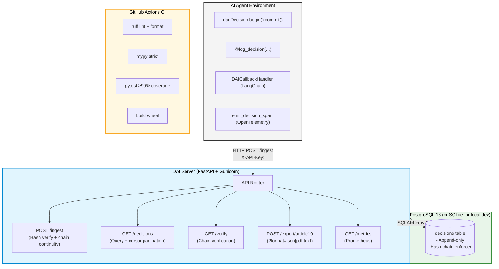

<div align="center">
  <h1>🛡️ DecisionLedger<br/>Decision Authority Infrastructure</h1>

  <p>
    <strong>Append-only decision ledger for AI agents in regulated environments.</strong><br>
    <em>EU AI Act Article 19 compliant by design.</em>
  </p>

  [](https://www.python.org/downloads/)
  [](https://opensource.org/licenses/MIT)
  [](https://artificialintelligenceact.eu/)
  [](https://github.com/rksingh95/DecisionLedger/actions/workflows/ci.yml)
  [](.github/workflows/ci.yml)
  [](docker/)

  <p>Built by <strong><a href="https://github.com/rksingh95">Mandate</a></strong> — <a href="https://github.com/rksingh95/DecisionLedger">github.com/rksingh95/DecisionLedger</a></p>
</div>

<hr/>

## 📖 Table of Contents

- [The Problem](#-the-problem)
- [What DAI Records](#-what-dai-records)
- [Quickstart — Docker (Recommended)](#-quickstart--docker-recommended)
- [Quickstart — Local Development](#-quickstart--local-development)
- [SDK Usage Patterns](#-sdk-usage-patterns)
- [Article 19 Compliance Export](#-eu-ai-act-article-19-compliance-export)
- [Configuration](#%EF%B8%8F-configuration)
- [CLI Reference](#-cli-reference)
- [Makefile Reference](#%EF%B8%8F-makefile-reference)
- [Hash Chain Verification](#-hash-chain-verification)
- [Architecture](#-architecture)
- [Testing & Code Quality](#-testing--code-quality)
- [Roadmap](#-roadmap)
- [Contributing & Licence](#-contributing--licence)

<hr/>

## 🚨 The Problem

AI agents make consequential decisions — approve a loan, triage a claim, flag a transaction — but those decisions are rarely recorded in a structured, auditable way. When regulators require an audit trail, or when an incident needs to be reconstructed, organisations discover they have logs but no ledger: timestamped text, not tamper-evident, typed records.

The **EU AI Act (Article 19)** now mandates structured logging for high-risk AI systems. DecisionLedger provides exactly that, as a drop-in SDK with a production-ready server.

<hr/>

## 📝 What DAI Records

Every decision produces a mathematically verifiable, tamper-evident record:

```yaml
decision_id:              "01927f3c-8a1b-7000-8000-000000000001"  # UUIDv7
record_hash:              "3a4f8c..."                              # SHA-256 of prev_hash + record
previous_hash:            "0000..."                               # Links to previous record
ledger_version:           "0.1.0"
decision_timestamp:       "2026-01-15T09:00:00.000000Z"
agent_id:                 "claims-agent-eu-01"
agent_type:               "autonomous"
model_version:            "gpt-4o-v2024-11"
authorized_scope:         "motor claims triage"
delegation_source:        "underwriting-team"
human_oversight_required: false
override_applied:         false
decision_type:            "motor_claims_triage"
subject_ref:              "claim:MC-2026-00142"
policy_id:                "motor-claims-v3"
policy_version:           "3.2.1"
clauses_applied:          ["3.1", "4.2", "5.3"]
outcome:                  "approved"
confidence:               0.93
evidence_refs:            ["doc:claim-form-142", "img:damage-photo-01"]
data_sources_accessed:    ["claims-db", "policy-db", "vehicle-registry"]
context_completeness:     "full"
exception_applied:        false
metadata:
  region:                 "EU"
  gdpr_basis:             "contract"
```

<hr/>

## 🐳 Quickstart — Docker (Recommended)

The fastest way to get a production-grade stack running locally with PostgreSQL:

```bash
git clone https://github.com/rksingh95/DecisionLedger.git
cd DecisionLedger

make docker-up
```

That's it. Under the hood it:
1. **Builds** the Docker image
2. **Starts PostgreSQL 16** and waits until healthy
3. **Runs Alembic migrations** automatically
4. **Starts the API server** (only after migrations succeed)

| Endpoint | URL |
|---|---|
| API | http://localhost:8080 |
| Interactive Docs (Swagger) | http://localhost:8080/docs |
| Health Check | http://localhost:8080/health |
| Prometheus Metrics | http://localhost:8080/metrics |

```bash
# Verify it's running
curl http://localhost:8080/health
# {"status": "ok", "version": "0.1.0"}
```

### Useful Docker commands

```bash
make docker-logs       # tail logs from all services
make docker-logs-api   # tail API server logs only
make docker-status     # show container health
make docker-psql       # open psql inside the container
make docker-shell      # bash into the API container
make docker-down       # stop (keeps database data)
make docker-clean      # stop + wipe the database volume
make docker-rebuild    # force rebuild from scratch
```

> **Conflict with a local Postgres?** If port 5432 is already in use:
> ```bash
> DAI_POSTGRES_PORT=5433 make docker-up
> ```

<hr/>

## 💻 Quickstart — Local Development

For SDK development and running tests without Docker:

```bash
git clone https://github.com/rksingh95/DecisionLedger.git
cd DecisionLedger

# One-time setup: creates .venv, installs deps, installs pre-commit hooks, copies .env
make install-dev

# Start server (uses SQLite by default — zero setup)
make server
# → API running on http://localhost:8080

# Run tests
make test
# ✓ 103 tests passed, 94% coverage
```

### 2. Install the SDK in your agent

```bash
pip install decision-ledger-sdk

# Configure
export DAI_ENDPOINT=http://localhost:8080
export DAI_API_KEY=dev-key-change-me
```

### 3. Record your first decision

```python
import dai

result = await (
    dai.Decision.begin(
        agent_id="my-agent",
        decision_type="claims_triage",
        subject_ref="claim:CLM-001",
    )
    .with_policy(policy_id="motor-claims-v3", policy_version="3.2.1")
    .with_authority(authorized_scope="triage", delegation_source="underwriting-team")
    .with_context(
        evidence_refs=["doc:claim-form", "img:damage-photo"],
        data_sources_accessed=["claims-db", "policy-db"],
    )
    .with_outcome(outcome="approved", confidence=0.93)
    .commit()
)
print(f"Recorded: {result.decision_id}")
```

<hr/>

## 🧩 SDK Usage Patterns

DAI is unopinionated. Choose the integration pattern that fits your codebase.

### Pattern 1 — Fluent Builder
*Best for explicitly constructed records deep in business logic.*

```python
import dai

result = await (
    dai.Decision.begin(
        agent_id="claims-agent-01",
        decision_type="claims_triage",
        subject_ref="claim:CLM-2025-001234",
        model_version="gpt-4o-2024-08-06",
    )
    .with_policy(
        policy_id="motor-claims-v3",
        policy_version="3.2.1",
        clauses_applied=["3.1", "4.2"],
    )
    .with_authority(
        authorized_scope="motor claims triage up to £10,000",
        delegation_source="underwriting-team",
        human_oversight_required=False,
    )
    .with_context(
        evidence_refs=["doc:claim-form-v2", "img:damage-photo-01"],
        data_sources_accessed=["claims-db", "policy-db", "fraud-api"],
    )
    .with_outcome(outcome="approved", confidence=0.93, alternatives_considered=3)
    .with_metadata("claim_value_gbp", "8500")
    .commit()
)
```

### Pattern 2 — Context Manager
*Best for wrapping existing code blocks. Auto-commits on exit, logs `conservative_fallback` if an exception is raised.*

```python
async with dai.Decision.begin(
    agent_id="risk-agent",
    decision_type="risk_classification",
    subject_ref="application:APP-001",
) as d:
    d.with_policy("risk-policy-v2", "2.1.0")
    d.with_authority("risk scoring", "risk-team")
    d.with_context(["credit-report:ref"], ["credit-bureau-api"])

    result = await classify_risk(application_id="APP-001")
    d.with_outcome(outcome=result.label, confidence=result.score)
# Auto-commits on exit. Exceptions are caught and recorded safely.
```

### Pattern 3 — Decorator
*Best for non-invasive integration with existing functions — zero changes to business logic.*

```python
from dai.decorators import log_decision

@log_decision(
    agent_id="claims-agent",
    decision_type="claims_triage",
    policy_id="motor-claims-v3",
    policy_version="3.2.1",
    extract_subject=lambda args, kwargs: f"claim:{kwargs['claim_id']}",
    extract_outcome=lambda r: {"outcome": r.decision, "confidence": r.score},
)
async def triage_claim(claim_id: str, data: dict) -> TriageResult:
    # Your existing function — untouched
    ...
```

### Pattern 4 — LangChain Callback
*Best for out-of-the-box framework support.*

```python
from dai.integrations.langchain import DAICallbackHandler

handler = DAICallbackHandler(
    agent_id="my-langchain-agent",
    decision_type="claims_triage",
    policy_id="policy-v3",
    policy_version="3.2.1",
)
agent_executor = AgentExecutor(agent=agent, tools=tools, callbacks=[handler])
# Decisions recorded automatically on agent finish/error
```

### Pattern 5 — OpenTelemetry
*Emit decision spans into your existing observability stack.*

```python
from dai.integrations.opentelemetry import enable_otel_bridge

enable_otel_bridge()
# Decisions are now emitted as OTEL spans to your configured exporter
```

<hr/>

## 🇪🇺 EU AI Act Article 19 Compliance Export

Article 19 of the EU AI Act requires providers of high-risk AI systems to maintain structured logs enabling post-hoc monitoring. DecisionLedger satisfies this with three export formats:

### Export formats

| Format | Use case | Command |
|---|---|---|
| **PDF** | Regulatory submission, human auditors | `?format=pdf` |
| **JSON** | Machine-readable, system integration | `?format=json` *(default)* |
| **Text** | Quick review, CI audit checks | `?format=text` |

### PDF Report — Sample

The PDF report is a professional A4 branded document with:
- **Cover page** — reporting period, ledger version, chain integrity badge
- **Executive Summary** — KPI strip (decisions, exceptions, overrides, chain status) + outcome distribution
- **Agent Activity** — per-agent decision counts
- **Decision Types** — breakdown by type
- **Policy Versions** — all policy versions active in the period
- **Exceptions & Overrides** — amber-highlighted flagged records with reasons
- **Chain Integrity** — verification method and status (SHA-256)
- **Individual Records** — full alternating-row table of every decision

📄 **[View sample Article 19 PDF report](article19_test_export.pdf)**

### Generate via API

```bash
# PDF report (downloads as article19_report_<timestamp>.pdf)
curl -X POST "http://localhost:8080/export/article19?format=pdf" \
  -H "X-API-Key: $DAI_API_KEY" \
  -H "Content-Type: application/json" \
  -d '{
    "from_timestamp": "2026-01-01T00:00:00Z",
    "to_timestamp":   "2026-12-31T23:59:59Z",
    "include_chain_proof": true
  }' \
  --output article19_report.pdf

# JSON export (default)
curl -X POST "http://localhost:8080/export/article19" \
  -H "X-API-Key: $DAI_API_KEY" \
  -H "Content-Type: application/json" \
  -d '{"from_timestamp": "2026-01-01T00:00:00Z", "to_timestamp": "2026-12-31T23:59:59Z"}'

# Plain text
curl -X POST "http://localhost:8080/export/article19?format=text" \
  -H "X-API-Key: $DAI_API_KEY" \
  -H "Content-Type: application/json" \
  -d '{"from_timestamp": "2026-01-01T00:00:00Z", "to_timestamp": "2026-12-31T23:59:59Z"}'
```

### Generate via CLI

```bash
dai export --from 2026-01-01 --to 2026-12-31 --format pdf
```

### What Article 19 compliance requires

- ✅ Full agent identity (ID, type, model version, delegation chain)
- ✅ Policy version and clauses applied at decision time
- ✅ Evidence references and data sources accessed
- ✅ Explicit exception and override capture with reasons
- ✅ **SHA-256 hash chain** for tamper evidence
- ✅ Structured export in JSON, PDF, and plain text

<hr/>

## ⚙️ Configuration

Control SDK behaviour via environment variables (`.env` files are loaded automatically).

| Variable | Type | Default | Description |
|---|---|---|---|
| `DAI_BACKEND` | `http\|sqlite\|noop` | `http` | Storage backend |
| `DAI_ENDPOINT` | `str` | `http://localhost:8080` | Server URL |
| `DAI_API_KEY` | `str` | `""` | API key |
| `DAI_TIMEOUT_SECONDS` | `float` | `2.0` | HTTP timeout |
| `DAI_MAX_RETRIES` | `int` | `3` | HTTP retry count |
| `DAI_ON_ERROR` | `raise_exception\|log_and_continue\|noop` | `log_and_continue` | Error policy |
| `DAI_SQLITE_PATH` | `str` | `./dai_local.db` | SQLite path (backend=sqlite) |
| `DAI_LOG_LEVEL` | `str` | `INFO` | Log level |
| `DAI_EMIT_OTEL_SPANS` | `bool` | `false` | OpenTelemetry spans |

### Server environment variables

| Variable | Default | Description |
|---|---|---|
| `DAI_DATABASE_URL` | `sqlite+aiosqlite:///./dev.db` | DB connection string |
| `DAI_API_KEY` | `dev-key-change-me` | Server authentication key |
| `DAI_CORS_ORIGINS` | `""` | Comma-separated allowed origins |
| `DAI_POSTGRES_PORT` | `5432` | Host port for Postgres (Docker) |

<hr/>

## 💻 CLI Reference

| Command | Description |
|---|---|
| `dai verify --from DATE --to DATE` | Verify hash chain integrity. Exit 0 = valid, 1 = broken. |
| `dai query [--agent] [--type] [--outcome] [--format]` | Query decision records |
| `dai export --from DATE --to DATE [--format json\|pdf\|text]` | Article 19 compliance export |
| `dai status` | Check server connectivity and ledger health |

<hr/>

## 🛠️ Makefile Reference

All developer workflows are available via `make`. Run `make help` to see all commands.

### Setup

```bash
make install-dev    # Create .venv, install all deps, set up pre-commit hooks, copy .env
make install-all    # Like install-dev but also includes langchain + opentelemetry extras
```

### Code Quality

```bash
make lint           # Run ruff linter (check only)
make format         # Auto-format with ruff (modifies files)
make typecheck      # Run mypy strict type-checker on dai/
make check          # lint + typecheck together
make pre-commit     # Run all pre-commit hooks on all files (useful before a PR)
```

### Testing

```bash
make test           # Unit tests with coverage (≥90% required)
make test-unit      # Unit tests only (fast)
make test-cov       # HTML coverage report → htmlcov/index.html
```

### Server (Local SQLite)

```bash
make server         # Start API with --reload on :8080 (SQLite, no Postgres needed)
make migrate        # Apply Alembic migrations locally
```

### Docker (Full Stack with Postgres)

```bash
make docker-up      # Build + start full stack (Postgres → migrate → API)
make docker-down    # Stop (keeps DB data)
make docker-clean   # Stop + wipe database volume
make docker-logs    # Tail all service logs
make docker-status  # Show container health
make docker-psql    # Connect to Postgres inside Docker
make docker-shell   # Bash into API container
make docker-rebuild # Force rebuild images from scratch
```

<hr/>

## 🔒 Hash Chain Verification

Each record's integrity hash is computed deterministically:

> `record_hash = SHA-256(previous_hash + ":" + canonical_json(record))`

If any historical record is modified, its hash changes — but the *next* record's `previous_hash` still points to the original value. This makes tampering instantly detectable. A full chain scan from `GENESIS_HASH` identifies exactly where the chain breaks.

```bash
dai verify --from 2026-01-01 --to 2026-12-31
# ✓ VERIFIED — 1,247 records, chain intact
```

Or via the API:

```bash
curl http://localhost:8080/verify \
  -H "X-API-Key: $DAI_API_KEY"
```

<hr/>

## 🏗️ Architecture



<hr/>

## 🧪 Testing & Code Quality

### Pre-commit hooks

Every `git commit` automatically runs:

| Hook | What it checks |
|---|---|
| `trailing-whitespace` / `end-of-file-fixer` | File hygiene |
| `check-yaml` / `check-toml` | Config syntax |
| `check-merge-conflict` | No conflict markers |
| `check-added-large-files` | Files < 500 KB |
| `debug-statements` | No stray `breakpoint()` / `pdb` |
| `ruff lint + auto-fix` | Style and correctness |
| `ruff format` | Consistent formatting |
| `mypy` | Type-check `dai/` |
| `pytest` | Unit tests |

Install hooks (done automatically by `make install-dev`):

```bash
pre-commit install
```

Run all hooks manually:

```bash
make pre-commit
```

### CI Pipeline (GitHub Actions)

Every push and PR runs:

1. **Lint** — `ruff check` + `ruff format --check`
2. **Type check** — `mypy --strict` on `dai/`
3. **Tests** — `pytest` with ≥ 90% coverage gate
4. **Build** — `python -m build` (sdist + wheel)

### Coverage

```
dai/                  94%
dai_server/           ~80%
```

<hr/>

## 🗺️ Roadmap

| Phase | Status | Description |
|---|---|---|
| 0 | 🟢 **Done** | Decision ledger, hash chain, Article 19 export (JSON + PDF + text) |
| 0 | 🟢 **Done** | FastAPI server, PostgreSQL, Docker one-command setup |
| 0 | 🟢 **Done** | LangChain + OpenTelemetry integrations |
| 0 | 🟢 **Done** | CI/CD pipeline, pre-commit hooks, 94% coverage |
| 1 | ⏳ Planned | Policy versioning, authority chains, override modelling |
| 2 | ⏳ Planned | Decision memory, policy drift detection |
| 3 | ⏳ Planned | Regulator-ready exports, integrity proofs, retention controls |

<hr/>

## 🤝 Contributing & Licence

- **Contributing**: Please see [CONTRIBUTING.md](CONTRIBUTING.md) for development setup, testing, and PR guidelines.
- **Licence**: MIT — Copyright © 2026 Mandate
